# Documentació
## 1. Nom de la pàgina web: PadelMania
## 2. Estructura de carpetes i arxius que conformen la pàgina web:
### 2.1. Carpeta _**Pàgina Responsive**_:
Dintre la carpeta _**Pàgina Responsive**_, podem trobar:
* Documents HTML
* Documents CSS
* Carpeta anomenada _**Fotos_padel**_.
* Carpeta anomenada _**README**_.
* Carpeta anomenada **Scripts**
### 2.2. Carpeta _**Fotos_padel**_:
A la carpeta anomenada _**Fotos_padel**_ trobam diferents fotografies dels elements fundamentals de pàdel i de la pàgina, com poden ser:
* Pales
* Jugadors / Parelles
* Logo de la pàgina
* Imatge de fons de la pàgina
### 2.3. Carpeta _**README**_:
En aquesta carpeta trobam el document **Markdown** on està la documentació de la pàgina web.
### 2.4. Carpeeta _**SCRIPTS**_
En aquesta carpeta podem trobar tots els **scripts** de la pàgina web
## 3. Tecnologies utilitzades en el desenvolupament de la pàgina web:
Les tecnologies que he utilitzat pel desenvolupament de la pàgina web son:
1. Visual Studio Code
    * HTML
    * CSS
2. Youtube
    * He empleat aquesta pàgina web per agafar idees alhora de desenvolupar la pàgina.
3. Moodle
    * Apunts de HTML, CSS i disseny web adaptable.
4. IA
    * He fet ús de intel·ligència artificial alhora de agafar informació per omplir la pàgina amb informació.
## 4. Característiques i funcionalitats de la pàgina web:
### 4.1. Funcionalitat:
Aquesta pàgina té la funcionalitat de conèixer el pàdel amb més profunditat, com pot ser:
* Història del pàdel.
* Formes de les pales.
* Les millors pales, segons la seva forma.
* Tipus de parelles que existeixen a pàdel.
* Els millors jugadors, segons el tipus de parella.
* Característiques de les pistes.
* Diferents tornejos que existeixen i els més importants.
### 4.2. Característiques de la pàgina:
#### 4.2.1. Header:
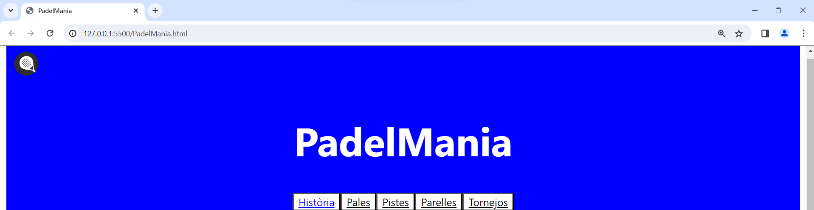
En aquesta captura podem observar el següent:
1. Tenim un logo de la pàgina a dalt a la esquerra.
2. El text de PadelMania, també ho tenc igual a totes les pàgines enllaçades, està centrat.
3. Hem posat un llistat de botons que tenen enllaços que ens duu a les altres pàgines enllaçades.
4. El fons es de color blau
#### 4.2.2. Fondo:
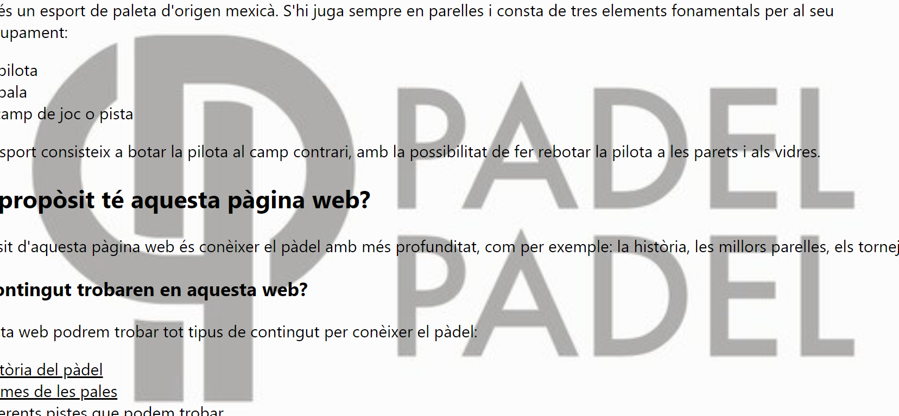
En aquesta captura podem observar que hem posat una imatge de fons que no interfereix en el contingut de la pàgina, ja que l'imatge es de color gris clar. Aquesta imatge està introduida a les altres pàgines.
#### 4.2.3. Llista amb enllaços:
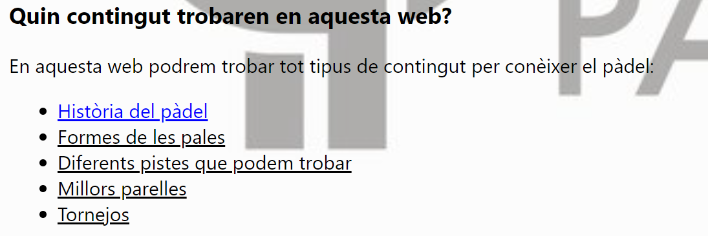
En aquesta imatge podem observar el següent:
1. Hi ha una llista desordenada.
2. En aquesta llista desordenada hem afegit contingut amb enllaços.
3. El color dels enllaços, tant als botons com aqui, es de color negre sense prémer i quan el polses es torna de color blay.
#### 4.2.4. Video:
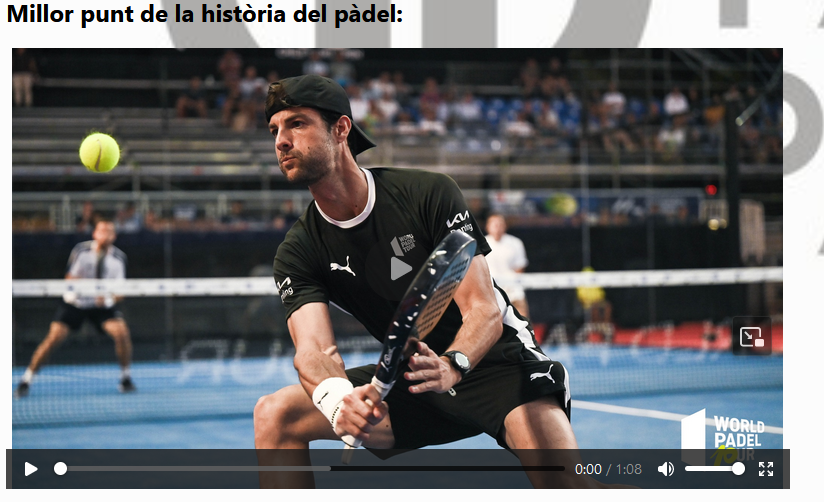
En aquesta captura podem observar el següent:
* Hem afegit un video amb audio i controls.
* Hem disminuit el tamany del video.
* Hem posat una imatge de poster.
#### 4.2.5. Footer:

En aquesta imatge podem observar:
1. El fons es de color negre.
2. El color de la lletra es de color blanc.
3. Quan no polses l'enllaç es de color blanc.
4. Quan polses l'enllaç es de color groc.
#### 4.2.6. Pàgina història:
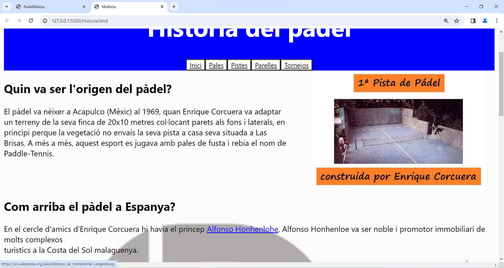
En aquesta imatge, podem observar el següent:
1. Hem afegir un nou botó anomenat **Inici**. Aquest botó ens dona l'opció de tornar a la pàgina inicial.
2. Hem afegit contingut rel·levant.
3. Hem afegit una foto a la dreta, amb relació al contingut del primer apartat.
#### 4.2.7. Pàgina responsive Història:
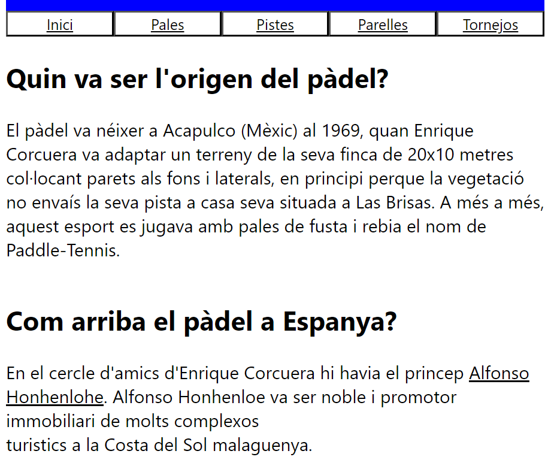
En aquesta pàgina podem observar que quan la pàgina es fa responsive succeeix el següent:
1. Els botons ocupen tot el header.
2. Desapareix l'imatge de fons i es tornà de color blanc.
3. L'imatge de la dreta també desapareix, ja que he considerat que no es rel·levant,
#### 4.2.8. Pàgina Pales:
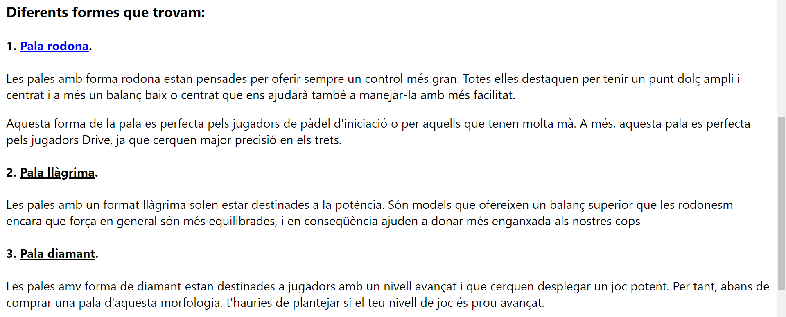
A aquesta pàgina podem observar el següent:
1. L'enllaç de la pàgina es de color blau quan es polsat, i quan no es de color negre.
2. Hem afegit tres pàgines en el títol, que ens duu cap a unes pàgines on trobam les tres millors pales de cada forma.
    * Una pàgina de millors pales rodones.
    * Una pàgina de millors pales llàgrima.
    * Una pàgina de millors pales diamant.
#### 4.2.9. Pàgina millors pales:
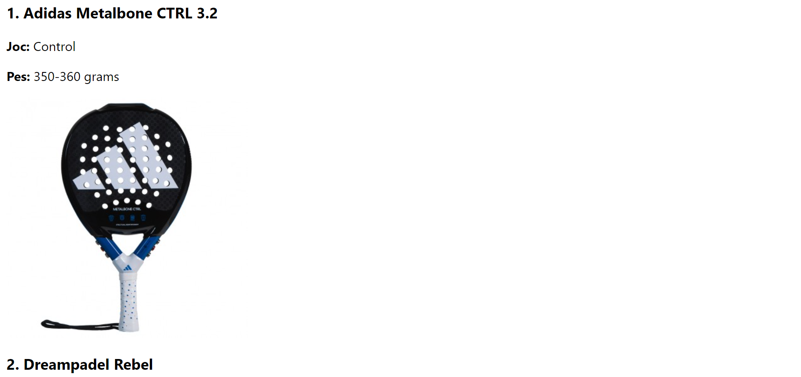
Podem observar que en aquesta pàgina hi ha tres imatges de les tres millors pales
#### 4.2.10. Pàgina responsive millors pales:
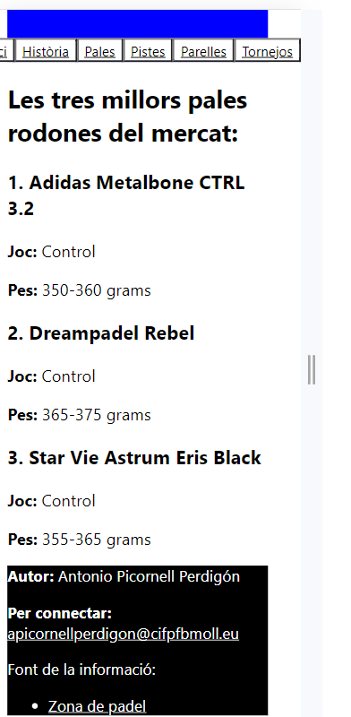
Quan aquesta pàgina es torna responsive, podem observar que les imatges desapareixen i només es mostra el títol i les característiques de les tres millors pales segons la seva forma.
#### 4.2.11. Pàgina Parelles:
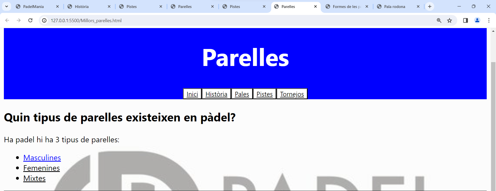
Podem observar el següent en aquesta pàgina:
1. Hi ha una llista desordenada.
2. A la llista desordenda, hi ha tres elements amb un enllaç.
3. Aquest enllaç ens dirigeix cap a tres seccions/pàgines diferents, on podem trobar les tres millors parelles masculines, femenines i mixtes.
#### 4.2.12. Pàgina millors parelles:
A les pàgines de millors parelles trobarem una secció d'aquesta manera:
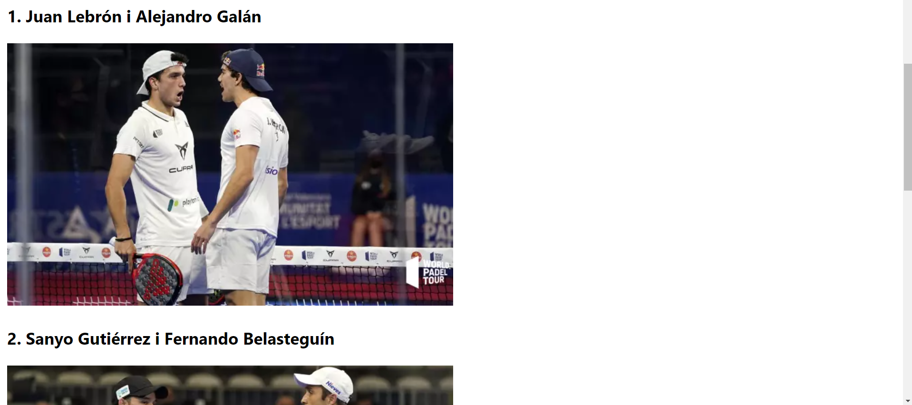
En aquestes pàgines hi ha les tres millors parelles segons si son:
* Masculines.
* Femenines.
* Mixtes.
#### 4.2.13. Pàgina Responsive millors parelles:
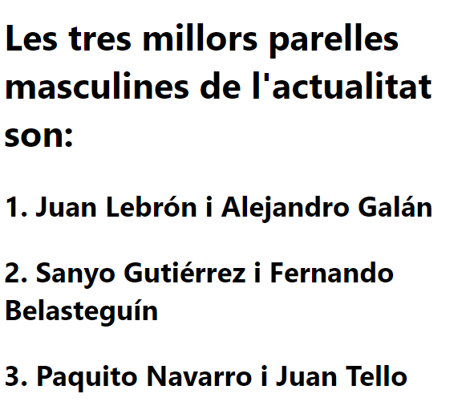
Quan la pàgina es torna responsive, podem observar que les imatges de les parelles/jugadors desapareixen i només apareix els noms dels tres millors parelles/jugadors.
#### 4.2.14. Tornejos:
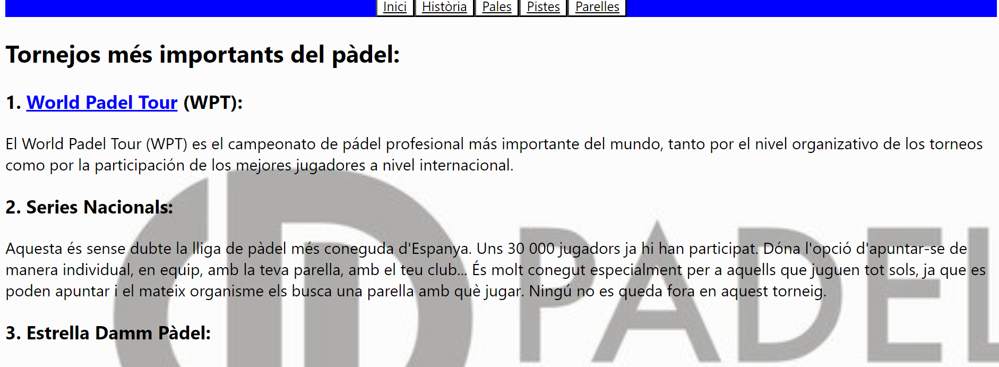
Podem observar, que la pàgina hi ha enllaços que ens duen a altres pàgines web.
## 5. INFORMACIÓ NOVA
### 5.1. Pàgines afegides
He afegit les seguüents pàgines:

* Iniciar Sessió com usuari.
* Crear Compte d'usuari.
* Recuperar Contrasenya.
* Enquesta de la pàgina
#### 5.1.1. Iniciar Sessió amb compte d'usuari:

He creat aquesta pàgina on podem iniciar sessió amb compte d'usuari.
#### 5.1.2. Crear Compte d'usuari:
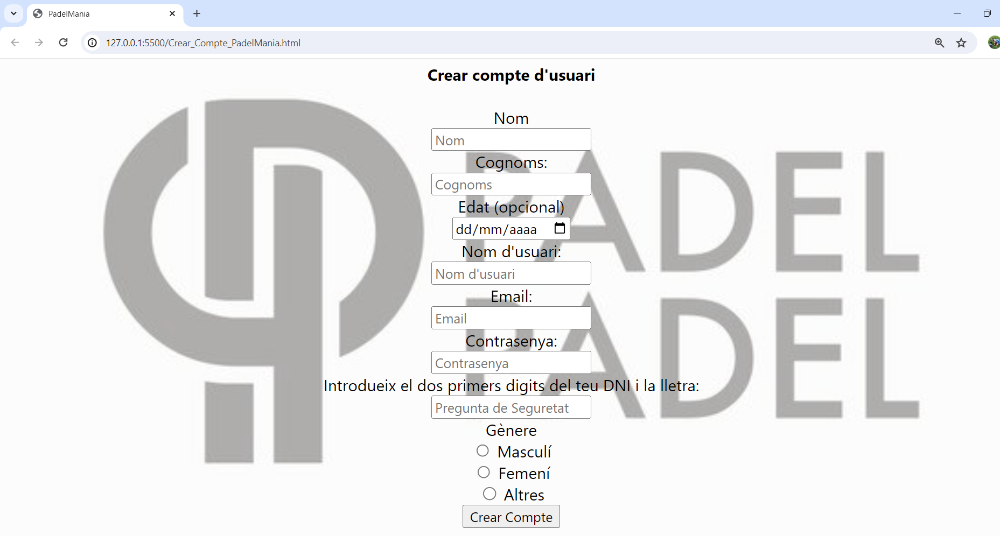
He creat aquesta pàgina on podem crear una compte d'usuari si no la tenim creada.
#### 5.1.3. Recuperar Contrasenya:
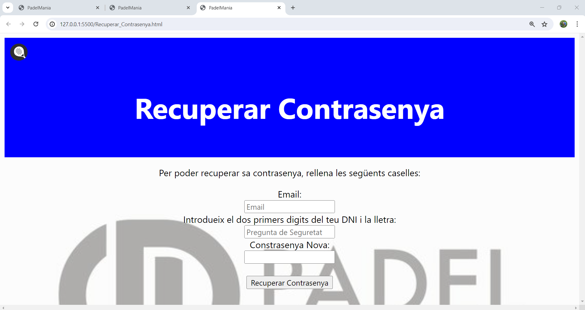
He creat aquesta pàgina on podem recuperar la nostra contrasenya si la hem perduda.
#### 5.1.4. Enquesta de satisfacció:
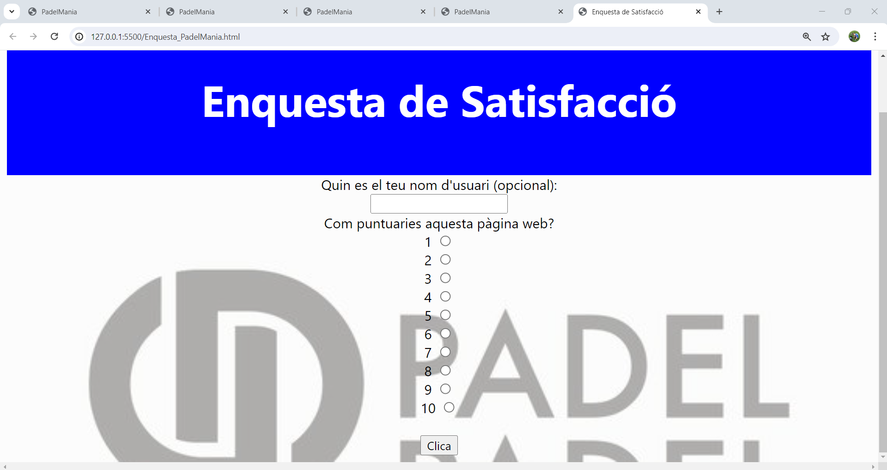
En aquesta pàgina podem valorar-la del 1 al 10.
### 5.2. Scripts
He afegit els següents **scripts**:
* Script per la pàgina de crear compte
* Script per la pàgina de enquesta
* Script per la pàgina de formes de les pales
* Script per la pàgina de història
* Script per la pàgina de Inici
* Script per la pàgina de millors parelles.
* Script per la pàgina de PadelMania
* Script per la pàgina de pales
* Script per la pàgina de parelles
* Script per la pàgina de pistes
* Script per la pàgina de recuperar la contrasenya
* Script per la pàgina de tornejos
#### 5.2.1. Script Crear Compte:
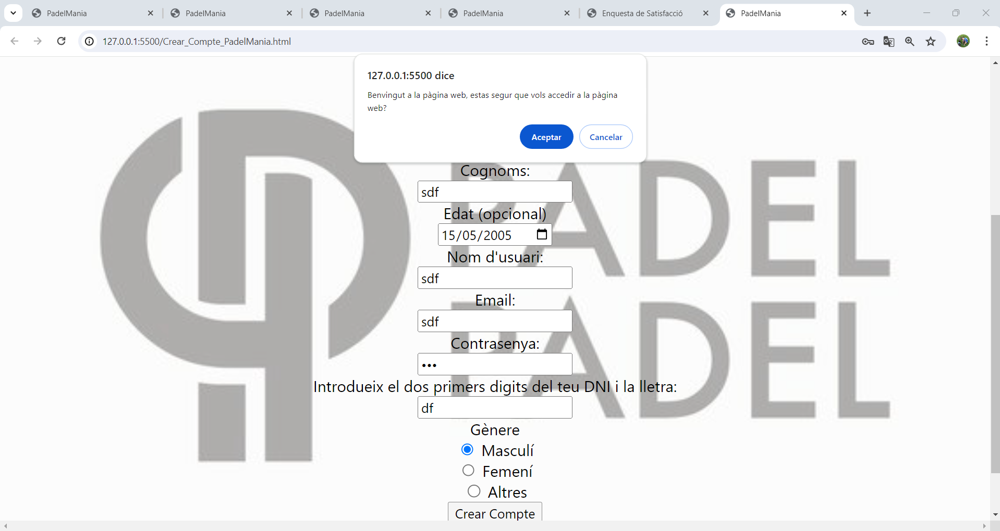
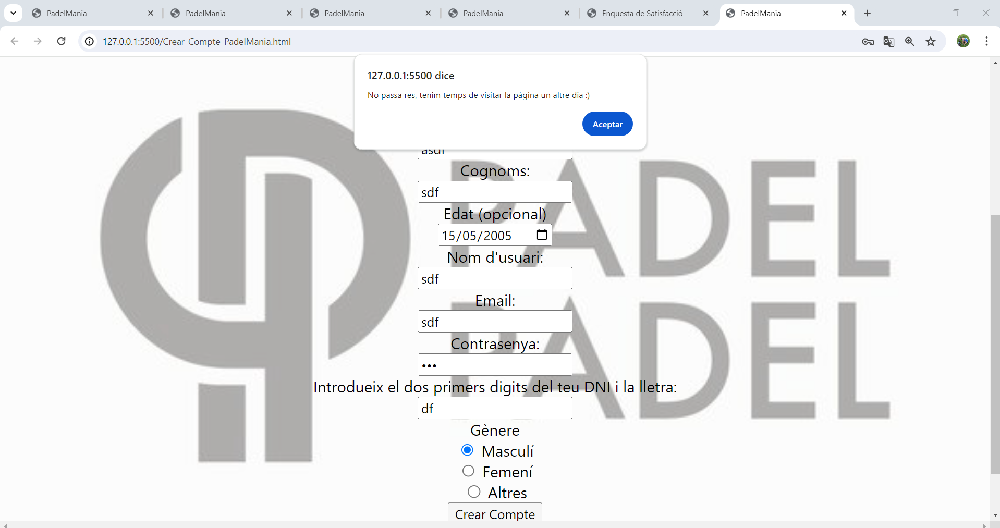
He creat un script on diu que sea creat la compte correctament i si vols accedir a la pàgina. Segons la resposta que diguis et sortirà un missatge o un altre
#### 5.2.2. Script Enquesta

He creat aquest script que segons la valoració que li donis sortirà un _alert_ amb un comentari personalitzat.
#### 5.2.3. Script Formes Pales:
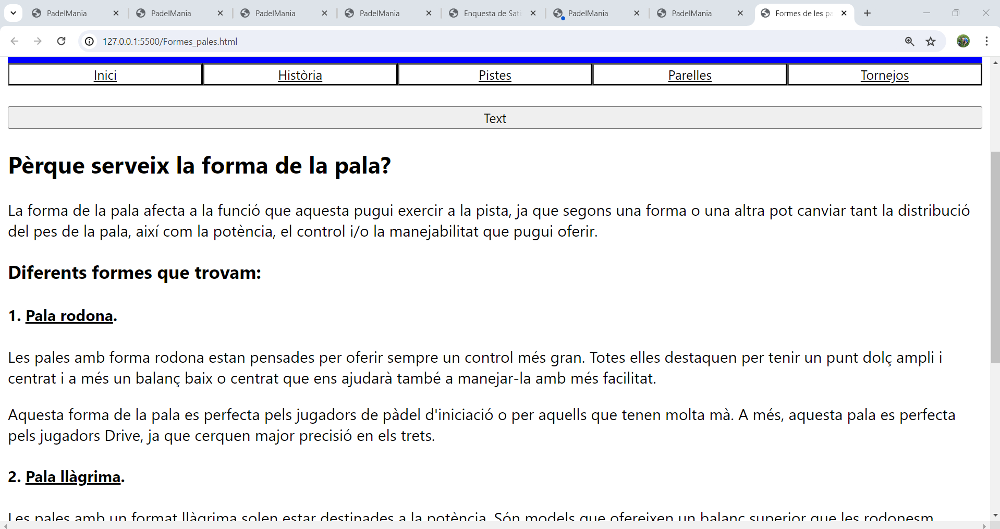
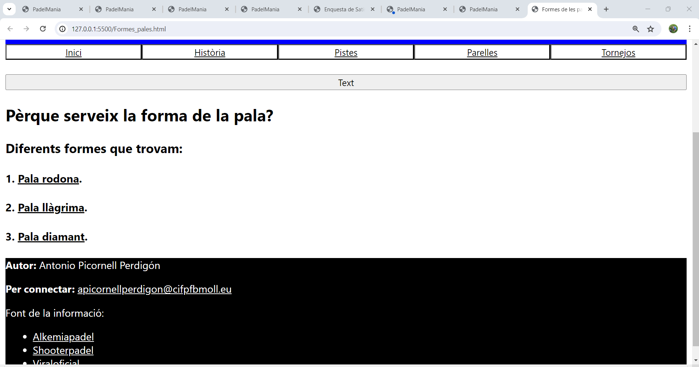
En aquest script si prens el botó el text es tornarà visible o invisible.
#### 5.2.4. Script de la Història:
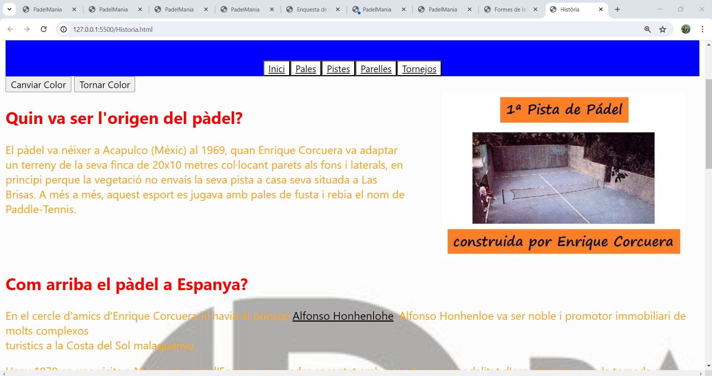
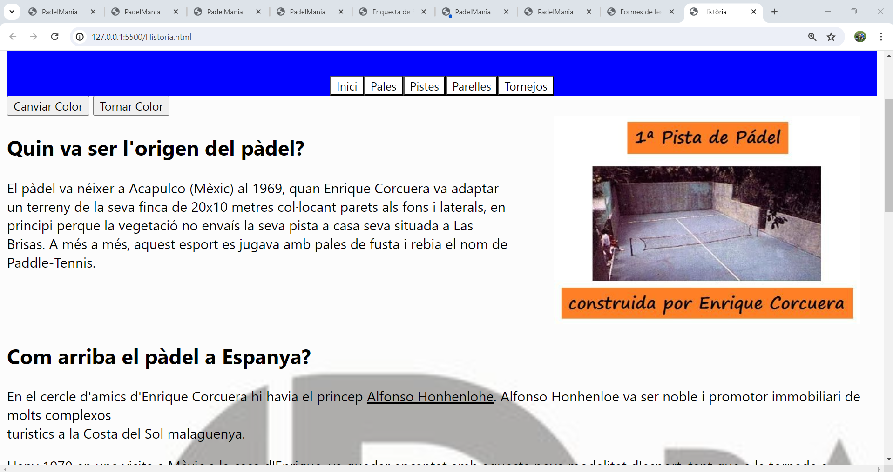
En aquest script hi ha dos botons, un que et tornà el text amb colors i l'altre si polses dues vegades es tornarà al seu color original.
#### 5.2.5. Script d'inici de PadelMania:
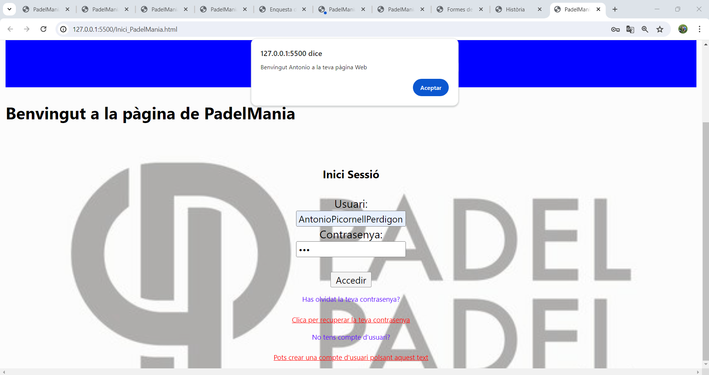
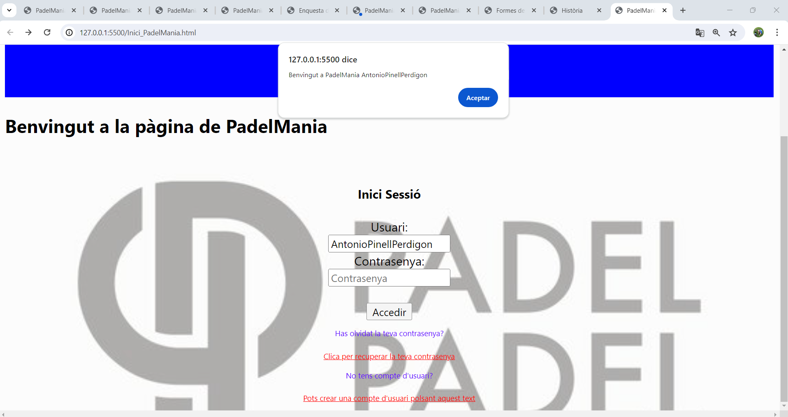
En aquest script, si poses el nom del administrador (AntonioPicornellPerdigon) sortirà un missatge personalitzat.
En canvi, si poses el nom d'usuari normal sortirà una benvinguda
#### 5.2.6. Script de millors parelles:

Sortirà un alert, desprès un prompt on tenim que posar el nostre nom d'usuari i desprès si dones a aceptar o cancel·lar et redireccionarà cap una pàgina externa o una altre.
#### 5.2.7. Script PadelMania:
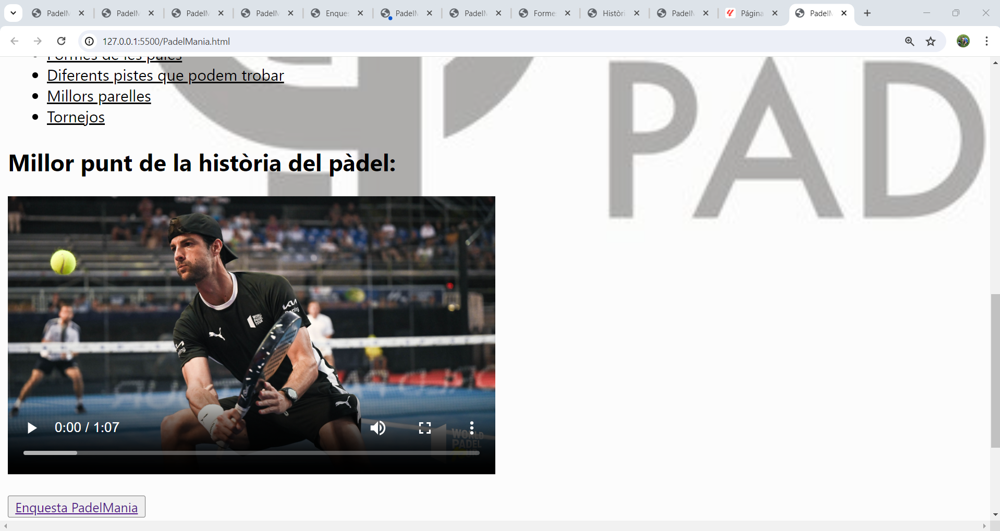
En aquesta pàgina, té un botó per ocultar o fer visible el video
#### 5.2.8. Pales:
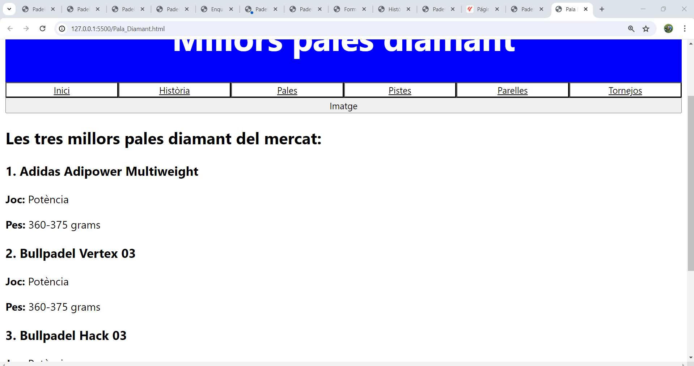
En aquesta pàgina, té un botó per ocultar o fer visible les imatges.
#### 5.2.9. Parelles:
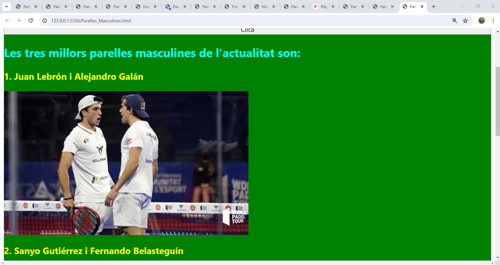
Té un botó per ocultar o fer visible les imatges. A més de canviar el color del text i fons
#### 5.2.10. Pistes
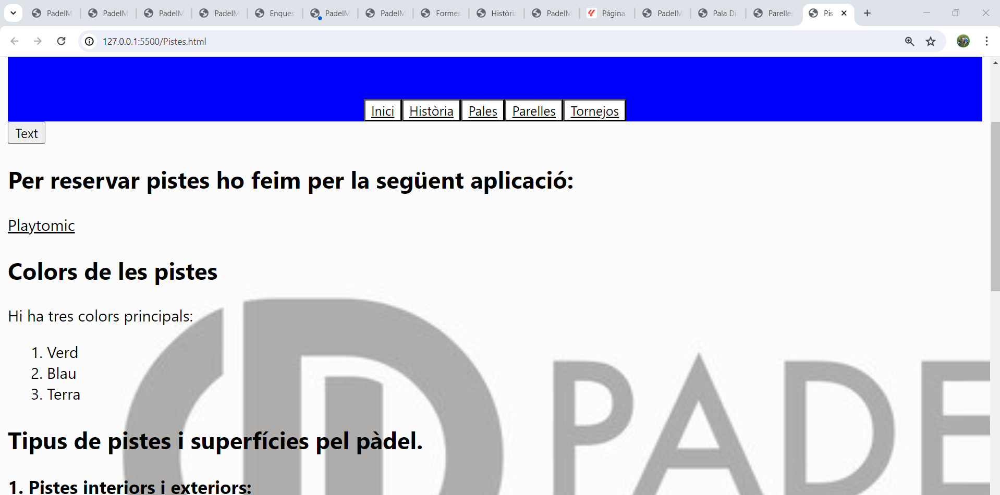
Té un botó per ocultar o fer visible el text
#### 5.2.11. Recuperar Contrasenya:
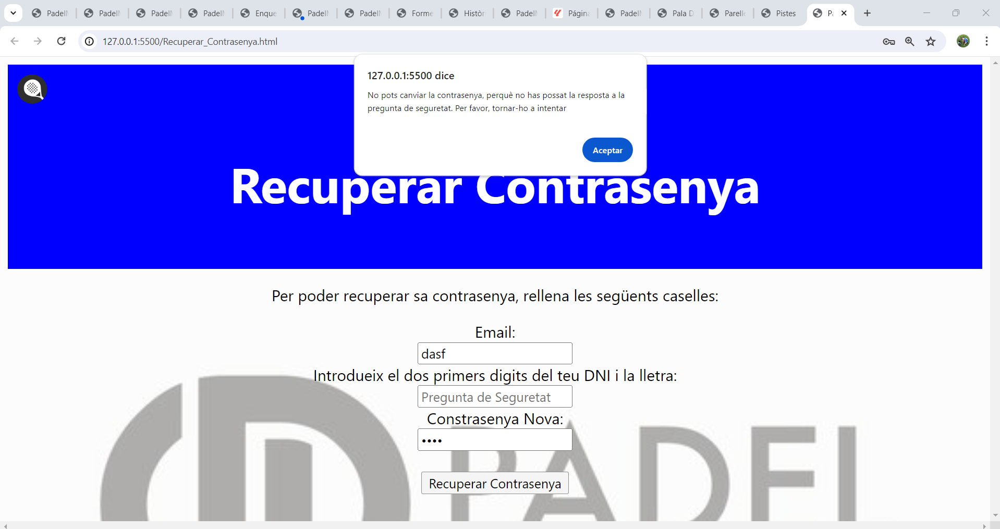
Té una funció que si té olvidres de rellenar qualque cap et sortirà un alert
#### 5.2.12. Tornejos:
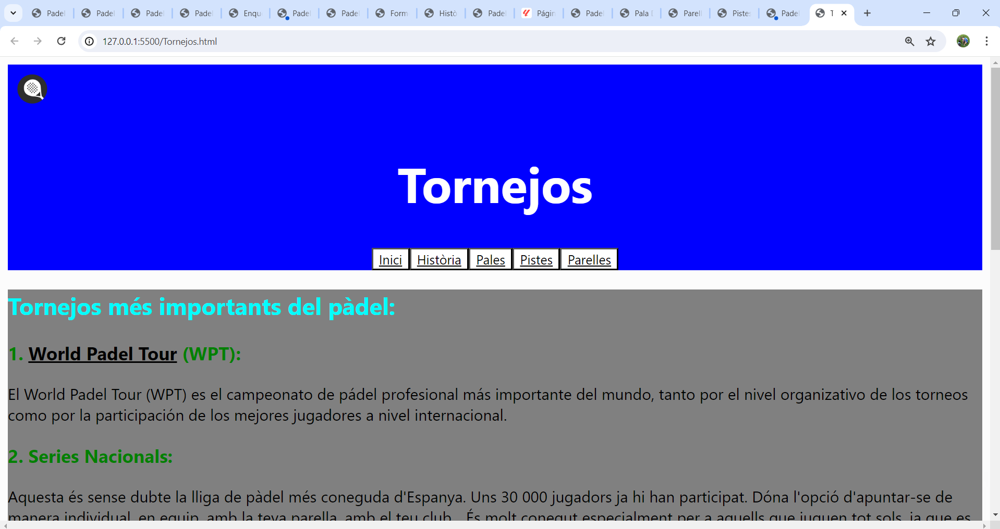
Si passes el ratolí per damunt del header canviarà de color, tant el fons com el text, i ocultarà el text
## 5. Font de la informació.
### 5.1. PadelMania:
[Wikipedia](https://es.wikipedia.org/wiki/P%C3%A1del#)
### 5.2. Història:
[Palma Racket Club](https://www.palmaracketclub.es/wp-content/uploads/2020/12/EL-padel.pdf)

[Padeladdict](https://www.padeladdict.com/historia-del-padel/)

[Pasionpadel](https://pasionpadel.com/historia-del-padel/)

[MEDAC](https://medac.es/blogs/masteres-online/historia-del-padel)

[Wikipedia](https://es.wikipedia.org/wiki/P%C3%A1del#La_primera_pista_de_p%C3%A1del)
### 5.3. Formes de les pales:
[Alkemiapadel](https://alkemiapadel.com/blogs/blog/guia-forma-molde-pala-padel)

[Shooterpadel](https://shooterpadel.com/blog/las-formas-de-las-pala-de-padel-redonda-mix-oversize-lagrima-y-diamante/)

[Viraloficial](https://www.viraloficial.com/es/blog/67_lagrima-redonda-o-diamante-que-elijo)
### 5.4. Pales rodones:
[Zona de padel](https://www.zonadepadel.es/blog/2023/09/mejores-palas-de-padel-de-control-2023/)
### 5.5. Pales llàgrima:
[Zona de padel](https://www.zonadepadel.es/blog/2023/09/las-mejores-palas-polivalentes-del-2023/)

[Zona de padel](https://www.zonadepadel.es/blog/2023/09/mejores-palas-de-padel-de-control-2023/)
### 5.6. Pales diamant:
[Zona de padel]( https://www.zonadepadel.es/blog/2023/09/las-mejores-palas-polivalentes-del-2023/)

[Zona de padel](https://www.zonadepadel.es/blog/2023/03/las-mejores-palas-de-padel-2023-cual-es-la-mejor/)
### 5.7. Pistes:
[Vall parc](https://www.vallparc.com/tipos-de-pistas-de-padel-y-sus-caracteristicas/)
### 5.8. Parelles Masculines:
[Diari Marca](https://www.marca.com/padel/2022/12/12/6395b81e22601dc90b8b45c6.html)
### 5.9. Parelles Femenines:
[Padeladdict](https://www.padeladdict.com/ranking-por-parejas-femeninas-en-world-padel-tour-2023/)
### 5.10. Parelles Mixtes:
[Chat GPT](https://chat.openai.com/)
### 5.11. Tornejos
[Eurofitness](https://eurofitness.com/blog-deportes/torneos-de-padel-mas-famosos/)
[Wikipedia](https://es.wikipedia.org/wiki/World_Padel_Tour)
## 6. Dades del autor:
**Autor:** Antonio Picornell Perdigón
**Correu electrònic:** apicornellperdigon@cifpfbmoll.eu